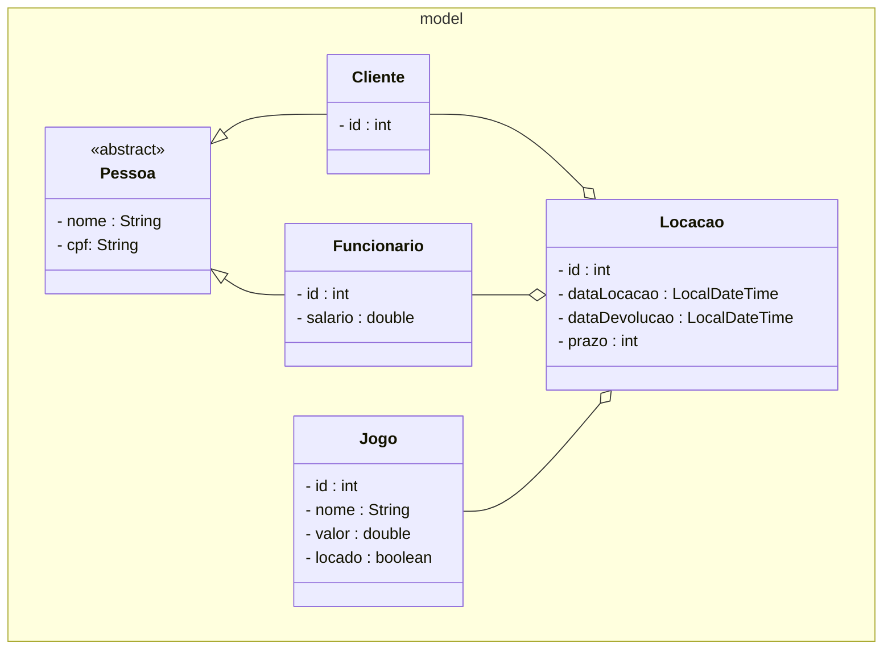

# LPOO 2025/2 — Locadora OJogos

O sistema Locadora OJogos consiste na gerência de uma locadora de jogos, possibilitando registrar clientes, funcionários, jogos e locações.

## Diagrama de Classes

## Features

O sistema, atualmente, pode:

- Registrar clientes.
- Registrar funcionários.
