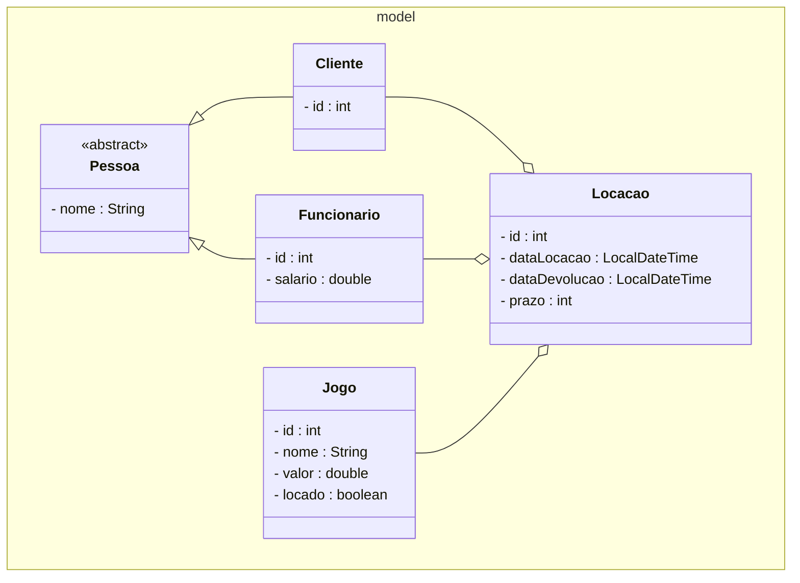

# LPOO 2025/2 -- Locadora OJogos

---
## Model Diagram

```mermaid
classDiagram
    namespace model {
        class Pessoa
        class Cliente
        class Funcionario
        class Jogo
        class Locacao
    }

    class Pessoa {
        <<abstract>>
        - nome : String
    }

    class Cliente {
        - id : int
    }

    class Funcionario {
        - id : int
        - salario : double
    }

    class Jogo {
        - id : int
        - nome : String
        - valor : double
        - locado : boolean
    }

    class Locacao {
        - id : int
        - dataLocacao : LocalDateTime
        - dataDevolucao : LocalDateTime
        - prazo : int
    }

    Pessoa <|-- Cliente
    Pessoa <|-- Funcionario

    Cliente --o Locacao
    Funcionario --o Locacao
    Jogo --o Locacao
```